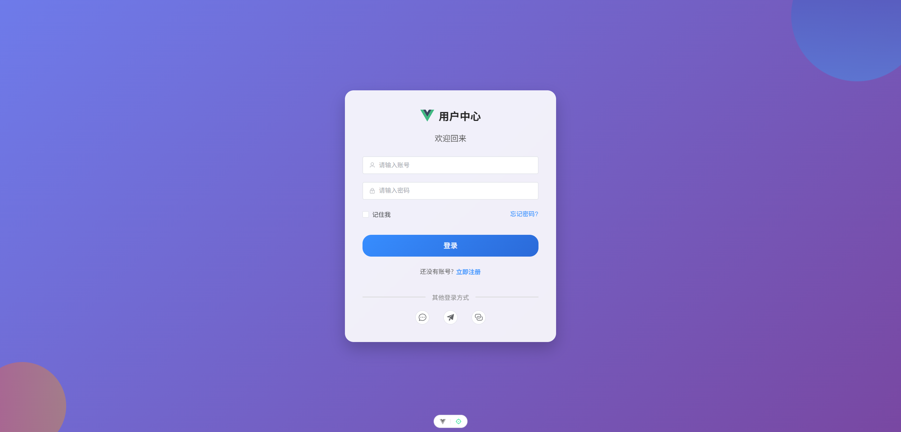
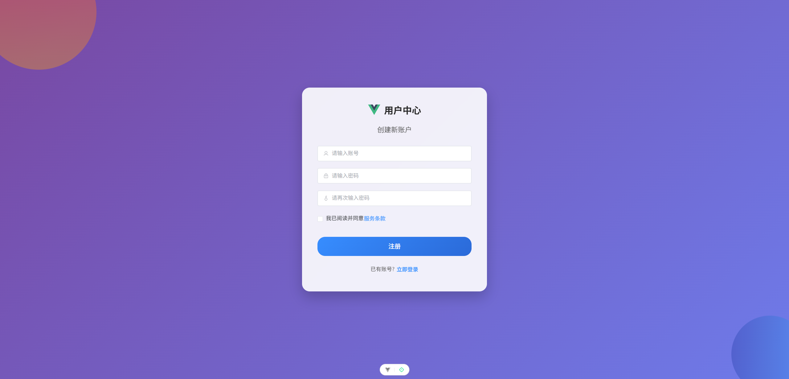
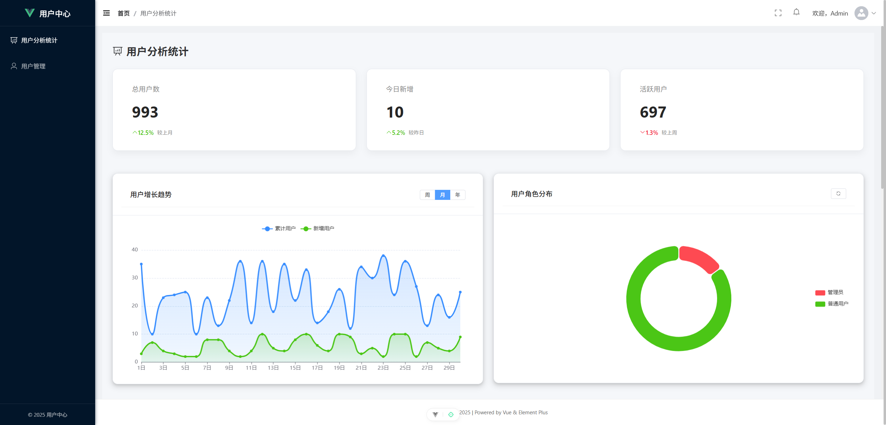
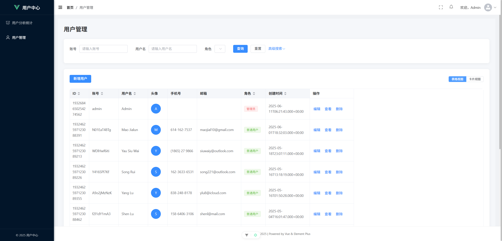

# 用户中心

一个基于 Vue 3 和 Spring Boot 的用户中心系统，提供用户注册、登录、管理等功能。

## 项目结构

项目分为前端和后端两个部分：

- 前端：基于 Vue 3 + TypeScript + Vite + Element Plus 构建
- 后端：基于 Spring Boot 构建 

## 功能特性

- 用户注册与登录

  

  

- 用户信息管理

- 用户数据分析

  

- 管理员用户管理界面

  

- 权限控制

## 前端技术栈

- **框架**: Vue 3
- **语言**: TypeScript
- **构建工具**: Vite
- **UI 组件库**: Element Plus
- **状态管理**: Pinia
- **路由**: Vue Router
- **HTTP 客户端**: Axios
- **图表**: ECharts

## 后端技术栈

- **框架**: Spring Boot
- **构建工具**: Maven
- **数据库**: MySQL 
- **API 文档**: Swagger (通过 OpenAPI 生成前端 API)

## 快速开始

### 前端

1. 安装依赖

```bash
npm install
```

2. 开发环境运行

```bash
npm run dev
```

3. 生产环境构建

```bash
npm run build
```

### 后端

后端项目位于独立的 `user-center-backend` 目录中。

## API 接口

接口文档调试地址：http://localhost:8123/api/doc.html

前端通过 Axios 与后端 API 进行通信，主要接口包括：

- 用户注册: `/user/register`
- 用户登录: `/user/login`
- 用户登出: `/user/logout`
- 获取当前登录用户: `/user/get/login`
- 用户管理: `/user/list/page/vo`, `/user/add`, `/user/update`, `/user/delete`

## 项目结构说明

### 前端目录结构

- `src/api`: API 接口定义
- `src/assets`: 静态资源
- `src/components`: 公共组件
- `src/router`: 路由配置
- `src/stores`: Pinia 状态管理
- `src/views`: 页面视图
  - `user`: 用户相关页面 (登录、注册)
  - `admin`: 管理员相关页面 (数据分析、用户管理)

## 开发者

本项目为个人学习项目。

